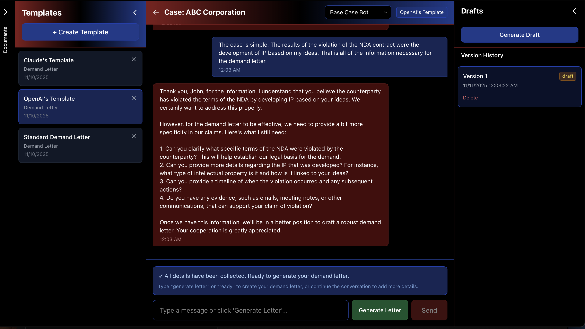

# DemandIt!



### Demo Video
[](https://www.youtube.com/watch?v=c_T43e2lF_8&pp=0gcJCQMKAYcqIYzv)

A modern React-based web application for managing legal cases and generating demand letters using AI. Built with authentication, case management, and persistent chat history.

## Features

- 🔐 User authentication (email/password via Supabase)
- 📋 Case management (create, view, delete cases)
- 🎨 Modern, responsive UI with Tailwind CSS
- 💬 Chat interface with message bubbles
- 💾 Persistent message history (saved to PostgreSQL)
- ⏰ Timestamp display for messages
- ⌨️ Keyboard shortcuts (Enter to send)
- 📄 Document upload and management
- 🤖 AI-powered legal demand letter generation
- 🎯 Chat type system for different use cases
- 🏠 Homepage with case list and navigation

## Getting Started

### Prerequisites

- Node.js (v18 or higher)
- npm or yarn
- Supabase account (sign up at https://supabase.com)
- OpenAI API key (get one at https://platform.openai.com/api-keys)

### Installation

1. Install dependencies:
```bash
npm install
```

2. Set up Supabase:
   - Follow the detailed instructions in [SUPABASE_SETUP.md](./SUPABASE_SETUP.md)
   - Create a Supabase project
   - Run the SQL script to create the database tables
   - Get your project URL and anon key

3. Create a `.env` file in the root directory:
```bash
VITE_SUPABASE_URL=your_supabase_project_url
VITE_SUPABASE_ANON_KEY=your_supabase_anon_key
VITE_OPENAI_API_KEY=your_openai_api_key
```

4. Start the development server:
```bash
npm run dev
```

5. Open your browser and navigate to the URL shown in the terminal (typically `http://localhost:5173`)

6. Sign up for a new account or sign in to get started!

## Project Structure

```
src/
  ├── components/
  │   ├── Auth.jsx             # Authentication component (login/signup)
  │   ├── HomePage.jsx         # Homepage with case list
  │   ├── CaseView.jsx         # Case detail view wrapper
  │   ├── CaseCreationModal.jsx # Modal for creating new cases
  │   ├── ProtectedRoute.jsx   # Route protection component
  │   ├── ChatBot.jsx          # Main chatbot container
  │   ├── ChatMessage.jsx      # Individual message component
  │   ├── ChatInput.jsx        # Message input component
  │   └── DocumentSidebar.jsx  # Document upload and management
  ├── config/
  │   └── chatTypes.js         # Chat type configurations
  ├── context/
  │   ├── AuthContext.jsx      # Authentication state management
  │   └── DocumentContext.jsx  # Document state management
  ├── services/
  │   ├── supabase.js          # Supabase client configuration
  │   ├── caseService.js       # Case and message database operations
  │   └── llmService.js         # LLM API integration
  ├── App.jsx                  # Root component with routing
  ├── main.jsx                 # Entry point
  └── index.css                # Global styles
```

## Application Flow

1. **Authentication**: Sign up or sign in to access the application
2. **Homepage**: View all your cases and create new ones
3. **Create Case**: Fill out contact information (yours and recipient's) in a modal
4. **Case View**: Open a case to access the chatbot interface
5. **Chat**: Select a chat type and start a conversation
6. **Generate Letter**: The AI generates a professional demand letter based on your conversation

## Chat Functionality

The application supports multiple chat types, with the first implementation being **Base Case Bot** for legal demand letter generation.

### Base Case Bot Chat Type

1. Open a case from the homepage
2. Select "Base Case Bot" from the chat type dropdown
3. Upload relevant documents (contracts, invoices, correspondence, etc.)
4. Start a conversation describing your situation
5. The AI will generate a professional legal demand letter based on your conversation and uploaded documents

The system uses prompt engineering to create comprehensive, professional demand letters that:
- Use formal, professional language
- Clearly state facts and legal basis
- Specify exact amounts or actions being demanded
- Include reasonable deadlines
- Mention potential legal consequences

### Case Management

- All cases are saved to your account
- Messages are automatically saved as you chat
- Selected chat types are remembered per case
- Cases can be deleted from the homepage

## Build for Production

```bash
npm run build
```

The built files will be in the `dist` directory.

## Deployment

### Deploy to Vercel

This project is configured for easy deployment to Vercel.

#### Option 1: Deploy via Vercel CLI

1. Install Vercel CLI globally:
```bash
npm i -g vercel
```

2. Login to Vercel:
```bash
vercel login
```

3. Deploy:
```bash
vercel
```

4. Follow the prompts to link your project and deploy.

#### Option 2: Deploy via Vercel Dashboard

1. Push your code to GitHub (if not already done):
```bash
git add .
git commit -m "Prepare for deployment"
git push origin main
```

2. Go to [vercel.com](https://vercel.com) and sign in with your GitHub account.

3. Click "Add New Project" and import your repository.

4. Configure environment variables in the Vercel dashboard:
   - Go to Project Settings → Environment Variables
   - Add the following variables:
     - `VITE_SUPABASE_URL` - Your Supabase project URL
     - `VITE_SUPABASE_ANON_KEY` - Your Supabase anon key
     - `VITE_OPENAI_API_KEY` - Your OpenAI API key

5. Click "Deploy" - Vercel will automatically detect the Vite configuration and deploy your app.

6. Your app will be live at a URL like `https://your-project-name.vercel.app`

**Note**: The `vercel.json` configuration file ensures proper routing for the React Router SPA.

## Tech Stack

- **Frontend**: React 18, React Router
- **Styling**: Tailwind CSS
- **Backend**: Supabase (PostgreSQL, Authentication)
- **Build Tool**: Vite
- **AI**: OpenAI API

## Database

The application uses Supabase (PostgreSQL) to store:
- User accounts (via Supabase Auth)
- Cases with contact information
- Chat messages with full history
- Case metadata (selected chat types, etc.)

See [SUPABASE_SETUP.md](./SUPABASE_SETUP.md) for detailed database setup instructions.

